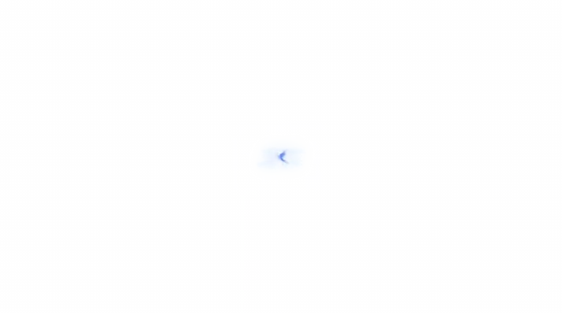

<h1> MultiChat</h1>

**Custom Multi-Platform Chat Overlay**

[Live site](https://gxufy.com/) · [Generator](https://gxufy.com/multichat)

A customizable **Kick, Twitch, YouTube and TikTok** chat overlay for OBS, with a separate multi-platform viewer counter.

Chat and viewer counts require no login. Twitch connection is optional and used only for native Twitch pinned messages.

## Features

- Kick, Twitch, YouTube and TikTok in one overlay
- Separate real-time multi-platform viewer counter
- 7TV, BTTV and FFZ emotes; 7TV paints, cosmetics, badges and zero-width emotes
- Platform badges, source markers and pinned messages
- Twitch Shared Chat support
- Font, size, color, stroke, shadow, emote scale, bold and uppercase controls
- Fade, entrance animation, slide-in and smooth-scroll controls
- Colored @mentions, transparent/custom backgrounds and message colors
- Moderation actions, bot filtering and username/message-prefix blacklists
- Fullscreen image, YouTube and TTS chat commands
- Generator UI is code-split from the OBS overlay startup path to keep browser sources lean

## Commands

Commands must be the **first word** of a message and require moderator or broadcaster access.

| Command | What it does |
| :--- | :--- |
| `!multichat ping` | Shows **Pong!** for 3 seconds. |
| `!multichat reload` | Reloads the browser source. |
| `!multichat stop` | Clears active notifications, images and videos. |
| `!multichat show` / `hide` | Shows or hides the chat without disconnecting. |
| `!multichat kickon` / `kickoff` | Shows or hides Kick messages without disconnecting. |
| `!multichat twitchon` / `twitchoff` | Shows or hides Twitch messages without disconnecting. |
| `!multichat youtubeon` / `youtubeoff` | Shows or hides YouTube messages without disconnecting. |
| `!multichat tiktokon` / `tiktokoff` | Shows or hides TikTok messages without disconnecting. |
| `!multichat sharedon` / `sharedoff` | Enables or disables Twitch Shared Chat display. |
| `!multichat counterbgon` / `counterbgoff` | Shows or hides the matching viewer-counter pill background. |
| `!multichat refresh [emotes]` | Reloads 7TV, BTTV and FFZ emotes without reloading the source. |
| `!multichat img <url\|emote> [-t seconds] [-o opacity]` | Shows a fullscreen image or emote. Use `img clear` to dismiss it early. |
| `!multichat yt <url\|preset> [-t seconds] [-m]` | Plays a fullscreen YouTube video. Presets: `bruh`, `vine-boom`, `dc-ping`, `rickroll`, `win-error`. |
| `!multichat tts <message>` | Reads a message aloud through the browser source. |

The generator's **Commands & help** section uses the same command registry as the overlay.

## Supported Services

<!-- prettier-ignore-start -->
| Service | Features |
| :--- | :--- |
|  **[Twitch](https://www.twitch.tv/)** | **Emotes:** Global, Channel, Follow, Sub, Bit **Badges:** Sub Badges, Bit Badges, Global Badges **Moderation:** Delete Messages, Timeouts, Bans, Chat Clears |
|  **[Kick](https://kick.com/)** | **Emotes:** Global, Channel, Sub **Badges:** Sub Badges, Global Badges **Moderation:** Delete Messages, Timeouts, Bans, Chat Clears |
|  **[YouTube](https://www.youtube.com/)** | **Emotes:** Native Unicode and YouTube channel emoji **Badges:** Owner, Moderator, Verified, Membership **Events:** Super Chats, Super Stickers, Memberships, Gifted Memberships **Moderation:** Message and Author Deletions |
|  **[TikTok](https://www.tiktok.com/)** | **Chat:** Live Comments **Badges:** Native TikTok Badges, Moderator, Subscriber **Events:** Gifts, Subscriptions, Follows, Shares **Moderation:** Message and Author Deletions, Pins |
|  **[7TV](https://7tv.app/)** | **Emotes:** Global, Channel, Personal/Special Sets, Auto Set Updates, Zero-Width **User Customization:** Paints, Badges, Personal/Special Emote Sets |
|  **[BTTV](https://betterttv.com/)** | **Emotes:** Global, Channel, Auto Set Updates |
|  **[FFZ](https://www.frankerfacez.com/)** | **Emotes:** Global, Channel **User Customization:** Global + Channel Badges |
<!-- prettier-ignore-end -->

## OBS Setup

Chat and the viewer counter use **separate browser-source URLs**.

1. Open [`gxufy.com/multichat`](https://gxufy.com/multichat).
2. Enter your channel name(s) and configure the overlay.
3. Add the **Chat URL** to OBS at **680 × 280**. *(830 × 230 also works as a wider, shorter layout.)*
4. Add the **Viewer Counter URL** as its own browser source.

Built by [gxufy](https://guns.lol/gxufy).